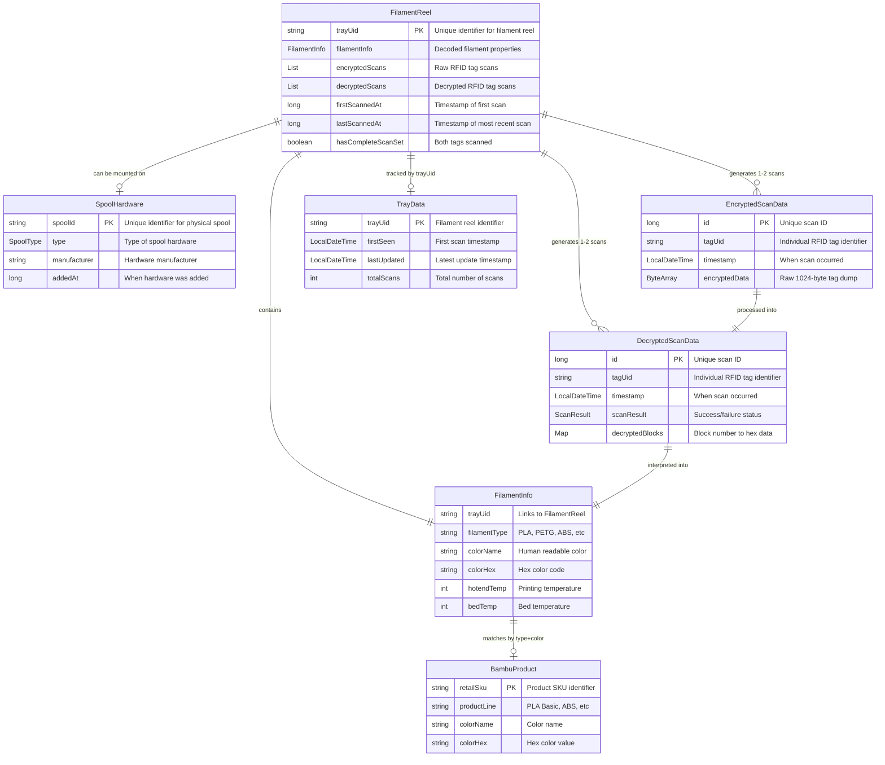
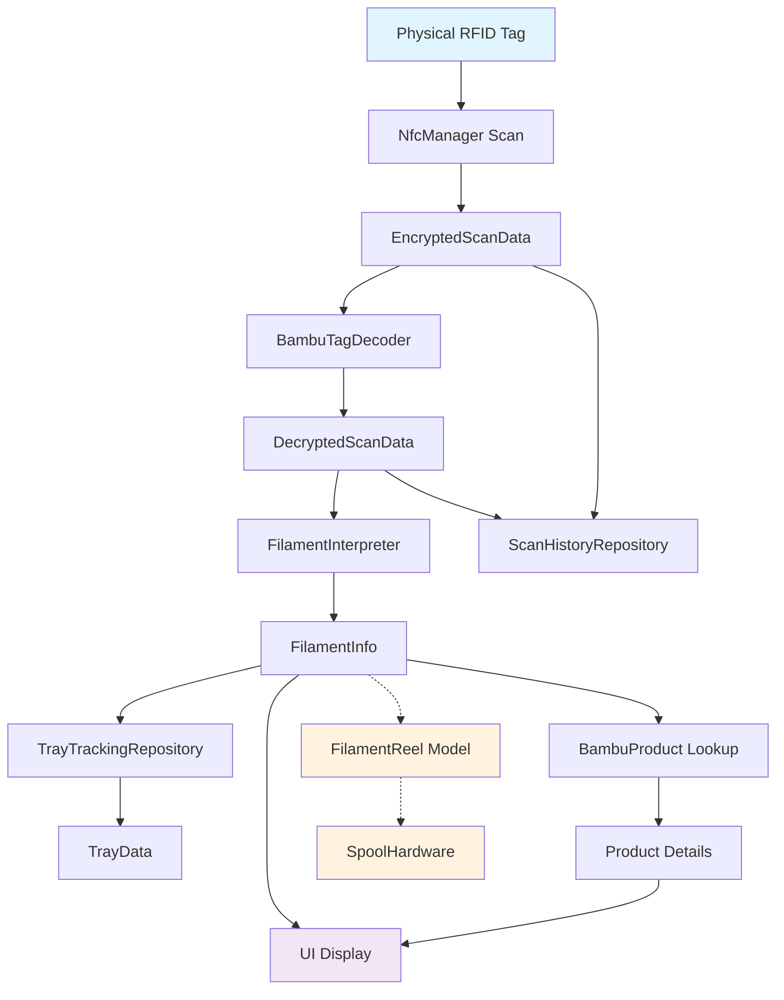

# B-Scan - Universal Component Inventory Management

An Android application for managing inventory components using **any identification method**. B-Scan is **identification-method agnostic** - supporting RFID/NFC scanning, QR codes, barcodes, manual handwritten IDs, serial numbers, batch numbers, SKU lookups, or any combination thereof. While initially focused on Bambu Lab 3D printer filament reels via RFID scanning, B-Scan has evolved into a universal inventory management platform where RFID filament is just one example among many trackable components and identification methods.

## Features

- **Universal Identification Methods**: Support for multiple ways to identify and track components:
  - **NFC/RFID Scanning**: Multiple tag formats (Bambu Lab, Creality, OpenTag, generic)
  - **QR Code Scanning**: Quick Response codes with flexible data formats
  - **Barcode Scanning**: Traditional 1D barcodes for standard inventory
  - **Manual Entry**: Handwritten IDs, serial numbers, or custom identifiers
  - **Batch Numbers**: Production batch tracking and quality control
  - **SKU Lookup**: Direct catalog-based component creation
- **Universal Component System**: Hierarchical inventory management where everything is a component:
  - Components can contain other components (parent-child relationships)
  - Components can be grouped as siblings under common parent
  - Flexible categories: filament, RFID tags, cores, spools, nozzles, tools
- **Catalog-Driven Inventory**: 
  - Identification data → SKU lookup → component instantiation
  - Build-time catalog (immutable manufacturer databases) + user-extensible catalog
  - Stock aggregation across multiple component instances per SKU
- **Advanced Component Display**: 
  - Material-specific geometric shapes (PLA=circle, ABS=hexagon)
  - Finish effects (silk shimmer, matte stippling, translucent backgrounds)
  - Precise hex colour matching with visual previews
- **BLE Scales Integration** (in development): Real-time weight measurements for consumption tracking
- **Export/Import System**: JSON-based backup with comprehensive data preservation
- **Material 3 Design**: Clean, modern interface following Google's latest design guidelines
- **Instant Results**: No internet connection required - all data comes directly from identification source or catalog
- **Flexible Data Entry**: Works with or without scanning hardware - manual entry fully supported

## Requirements

- Android device (Android 10 / API level 29 or higher)
- **Optional hardware features**:
  - NFC capability for RFID tag scanning
  - Camera for QR code and barcode scanning
  - Bluetooth LE for scale integration
- **No hardware required for**:
  - Manual inventory entry and management
  - Catalog browsing and SKU lookup
  - Component relationship management

## Installation

1. Download the latest APK from the [releases page](../../releases)
2. Enable "Install from unknown sources" in your Android settings
3. Install the APK file
4. Grant NFC permissions when prompted

## Usage

1. **Launch the app** and ensure NFC is enabled on your device
2. **Hold your phone** near the RFID tag on a Bambu Lab filament reel
3. **Wait 2-3 seconds** for the tag to be read completely
4. **View the results** displaying all filament specifications and properties

The app will automatically decode the RFID data and present it in an easy-to-read format with colour visualisation and technical specifications.

### Supported Tag Formats

**Bambu Lab RFID Tags** (Primary Support):
- All Bambu filament types: PLA (Basic, Matte, Silk, Galaxy, Sparkle), PETG, ABS, ASA, Support materials
- Dual identifier system: Hardware UID (authentication) + Tray UID (consumable tracking)
- Complete filament specifications, temperature settings, production data

**Creality RFID Tags** (Extended Support):
- ASCII-encoded filament data in blocks 4-6
- Single identifier system using hardware UID

**OpenTag Format** (Planned):
- User-configurable tag formats
- Custom component definitions

## Technical Details

- **Platform**: Android (Kotlin)
- **UI Framework**: Jetpack Compose with Material 3
- **Target SDK**: Android 14 (API 35)
- **Minimum SDK**: Android 10 (API 29)
- **Architecture**: MVVM with single Activity, hierarchical component system
- **NFC Protocol**: ISO 14443-A (Mifare Classic 1K)
- **Tag Formats**: Multi-format support (Bambu Lab, Creality, OpenTag)
- **Data Management**: Catalog-driven component instantiation with dual storage

### Universal Component Architecture

B-Scan uses a hierarchical component system where everything is represented as a `Component`:

#### Core Architecture Concepts
- **Component**: Universal model for any trackable inventory item
- **Hierarchical Relationships**: Components can contain other components (parent-child)
- **Sibling Groupings**: Multiple components can share the same parent
- **Flexible Categories**: `filament`, `rfid-tag`, `core`, `spool`, `nozzle`, etc.
- **Inventory Items**: Root components with unique identifiers

#### Catalog-Driven System
- **SKU Templates**: Catalog entries define component creation templates
- **Identifier → SKU → Component**: Any identification method looks up SKU to instantiate components
- **Stock Aggregation**: Multiple component instances track total inventory per SKU
- **Build-time + User Catalogs**: Immutable official data + extensible user entries

#### Universal Identifier System

B-Scan supports multiple identifier types per component, allowing any combination of identification methods:

**ComponentIdentifier Types**:
- **RFID_HARDWARE**: Built-in NFC/RFID chip identifiers (authentication)
- **CONSUMABLE_UNIT**: Batch or unit identifiers (tracking consumables)
- **QR**: Quick Response code data
- **BARCODE**: Traditional 1D barcode data
- **SERIAL_NUMBER**: Handwritten or typed serial numbers
- **SKU**: Direct catalog stock keeping unit references
- **BATCH_NUMBER**: Production batch tracking
- **MODEL_NUMBER**: Equipment model identification
- **CUSTOM**: User-defined identifier types

**Identifier Purposes**:
- **AUTHENTICATION**: Verify authenticity (e.g., RFID security)
- **TRACKING**: Monitor usage and location
- **LOOKUP**: Reference catalog information
- **DISPLAY**: Human-readable labels
- **LINKING**: Connect related components

#### Example Identifier Patterns

**Bambu Lab Pattern**: Dual identifier system
- **Hardware UID**: Built-in chip identifier (authentication)
- **Tray UID**: Consumable unit identifier (shared between 2 tags on same reel)
- **Component Hierarchy**: Tray component (root) → RFID tags + filament + hardware (siblings)

**Manual Entry Pattern**: Human-driven identification
- **Serial Number**: Handwritten or typed component serial
- **Batch Number**: Production lot identification
- **Custom ID**: Any user-defined identification scheme

**Mixed Pattern**: Multiple identification methods per component
- **QR Code**: Quick scanning for component details
- **Serial Number**: Backup manual identification
- **SKU**: Direct catalog reference
- **Custom Tag**: Workshop-specific labeling system

**Workshop Equipment Pattern**: Non-consumable tracking
- **Model Number**: Equipment model identification  
- **Serial Number**: Individual unit tracking
- **Barcode**: Standard inventory system integration

#### Component Example (Bambu Filament)
```
Tray Component (uniqueId: "01008023..." [tray UID])
├── RFID Tag #1 (uniqueId: "A1B2C3D4" [hardware UID])
├── RFID Tag #2 (uniqueId: "E5F6A7B8" [hardware UID])  
├── Filament (consumable material, variable mass)
├── Core (reusable hardware, 33g)
└── Spool (reusable hardware, 212g)
```

## Entity Relationships

The following diagrams illustrate the relationships between core B-Scan entities:

### Data Model



### Data Flow



### Identification Hierarchy

1. **Tag UID**: Identifies individual RFID chips (2 per FilamentReel)
2. **Tray UID**: Identifies FilamentReel (shared by its 2 tags)  
3. **Spool ID**: Identifies SpoolHardware (separate lifecycle)
4. **SKU**: Identifies product type in catalog

## Documentation

Comprehensive documentation is available in the [docs/](docs/) directory:

- **[Cache Design](docs/CACHE_DESIGN.md)** - Architecture and implementation of the high-performance caching system
- **[Development Guide](docs/DEVELOPMENT.md)** - Development setup, building, and testing instructions
- **[Implementation Summary](docs/IMPLEMENTATION_SUMMARY.md)** - Detailed technical implementation overview
- **[Security Analysis](docs/SECURITY_ANALYSIS.md)** - Security considerations and threat analysis

For developers looking to contribute or understand the codebase, start with the [Development Guide](docs/DEVELOPMENT.md).

## Screenshots

*Screenshots will be added once the app is implemented*
ble scale
## Privacy & Security

- **No data collection**: App processes identification data locally and doesn't transmit any information
- **No internet required**: All processing happens on-device
- **Local storage only**: Inventory data is stored locally on your device
- **Read-only access**: App cannot modify or write to identification sources (RFID tags, etc.)

## Current Limitations

**RFID/NFC Scanning**:
- Currently supports Bambu Lab and Creality RFID formats
- Cannot read heavily encrypted or physically damaged tags
- Requires physical proximity for NFC (range ~4cm)
- Does not support tag writing or modification

**Camera Scanning**:
- QR code and barcode scanning require adequate lighting
- Camera-based scanning needs clear, unobstructed view

**General**:
- Offline-only operation (by design for privacy)
- Manual backup required for data preservation across devices

## Related Projects

This app is part of a larger ecosystem of Bambu Lab RFID tools:

- **[OpenSpool](../OpenSpool/)**: ESP32 hardware for automatic filament detection
- **[RFID-Tag-Guide](../RFID-Tag-Guide/)**: Research documentation for Bambu Lab RFID protocols
- **[BambuSpoolPal](../MrBambuSpoolPal-BambuSpoolPal_AndroidApp/)**: Full-featured app with Spoolman integration
- **[Spoolease](https://www.spoolease.io/)**: Web-based filament spool management platform
- **[Filaman](https://www.filaman.app/)**: Filament tracking and management application
- **[MyFilametrics](https://www.myfilametrics.com/)**: Advanced filament analytics and monitoring platform

### RFID Tag Database Resources

For researchers and developers working with Bambu Lab RFID tags, several community-maintained databases exist:

- **[Bambu-Research-Group/RFID-Tag-Guide](https://github.com/Bambu-Research-Group/RFID-Tag-Guide)**: Primary research repository with tools and methodology for reading Bambu Lab RFID tags
- **[queengooborg/Bambu-Lab-RFID-Library](https://github.com/queengooborg/Bambu-Lab-RFID-Library)**: Most comprehensive collection (~100+ variants) of actual tag dump files organised by material/colour
- **[ImNoahDev/Bambu-RFID-Database](https://github.com/ImNoahDev/Bambu-RFID-Database)**: Community project for collecting tag data (early stage)

### RFID Mapping Structure (Bambu Filament)

Bambu Lab filament RFID tags encode product information using a three-part key: `"MaterialID:SeriesCode-ColorCode"`

**Example**: `"GFL00:A00-K0"` identifies a specific black PLA Basic product variant

**Structure**:
1. **MaterialID** (e.g., GFL00): Base filament material
   - GFL00 = PLA Basic, GFL01 = ABS, GFL02 = PLA Silk
   - GFL04 = TPU, GFG01 = PETG, GFC00 = PC, GFN04 = PA (Nylon)

2. **SeriesCode** (e.g., A00): Product series or manufacturing batch
   - A00 = Standard series, G50 = Carbon Fibre variant, G02 = Regular PETG

3. **ColorCode** (e.g., K0): Colour variant within the series  
   - K0 = Black, P7 = Purple, W0 = White, G0/G2 = Grey/Green

This identifier is stored in Block 1 of the RFID tag and used by B-Scan to look up specific product SKUs for enrichment with pricing, descriptions, and purchase links.

**Note**: No repository contains data for ALL Bambu Lab RFID tags due to:
- RSA signature protection preventing tag modification
- Physical collection requirements (expensive to acquire all variants)  
- Ongoing product releases with new colours/materials
- Community-dependent data collection efforts

The queengooborg library provides the most complete public collection but still has significant gaps across the full product line.

#### Development Resources
For developers working with B-Scan:
- **Real tag data available as submodule**: `test-data/rfid-library/` contains 361 JSON dump files
- **Initialize submodule**: `git submodule update --init --recursive` after cloning
- **Use for testing**: Comprehensive decoder validation against real Bambu Lab RFID data

## License

This project is licensed under the GNU General Public License v3.0 - see the [LICENSE](LICENSE) file for details.

## Contributing

Contributions are welcome! Please feel free to submit issues or pull requests.

1. Fork the repository
2. Create your feature branch
3. Make your changes
4. Test thoroughly on real Bambu Lab tags  
5. Submit a pull request

## Disclaimer

This is an unofficial third-party application. It is not affiliated with or endorsed by Bambu Lab. Use at your own risk.