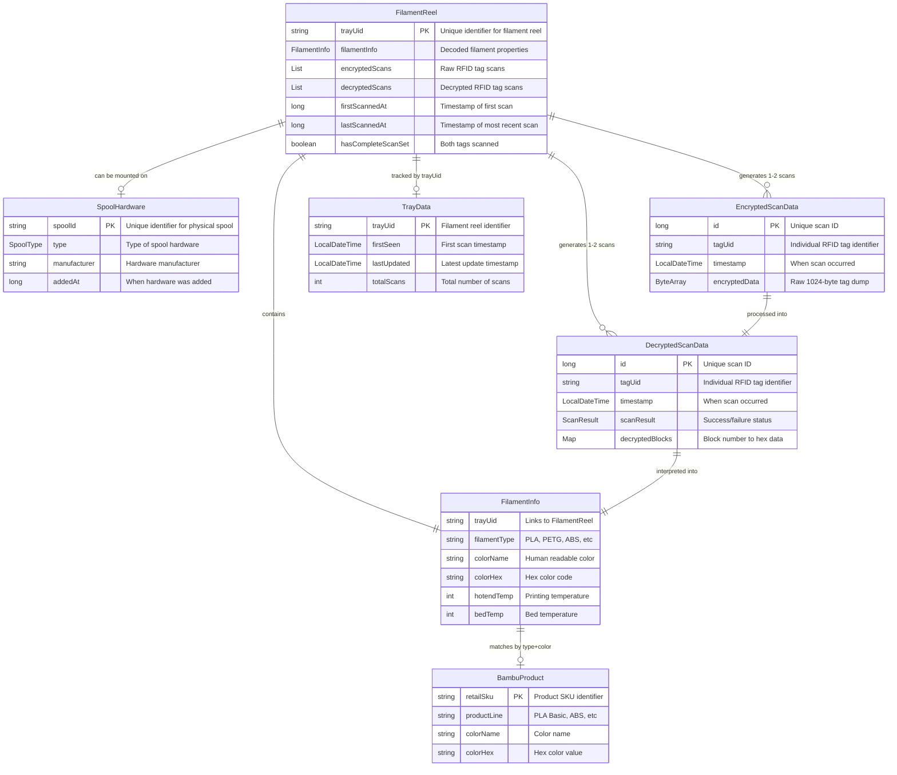

# B-Scan - Bambu RFID Tag Reader

A simple Android application for reading and displaying Bambu Lab 3D printer filament spool RFID tags. This app provides a clean, read-only interface to view filament information directly from NFC-enabled Bambu Lab spools.

## Features

- **NFC Tag Scanning**: Tap your Android device against Bambu Lab filament spools to read their RFID data
- **Filament Information Display**: View detailed spool information including:
  - Filament type (PLA, PETG, ABS, etc.)
  - Color name and hex code with visual preview
  - Material specifications (diameter, weight, length)  
  - Temperature settings (hotend, bed, drying)
  - Production date and tray UID
- **Material 3 Design**: Clean, modern interface following Google's latest design guidelines
- **Instant Results**: No internet connection required - all data comes directly from the tag

## Requirements

- Android device with NFC capability
- Android 10 (API level 29) or higher
- Bambu Lab filament spools with RFID tags

## Installation

1. Download the latest APK from the [releases page](../../releases)
2. Enable "Install from unknown sources" in your Android settings
3. Install the APK file
4. Grant NFC permissions when prompted

## Usage

1. **Launch the app** and ensure NFC is enabled on your device
2. **Hold your phone** near the RFID tag on a Bambu Lab filament spool
3. **Wait 2-3 seconds** for the tag to be read completely
4. **View the results** displaying all filament specifications and properties

The app will automatically decode the RFID data and present it in an easy-to-read format with colour visualisation and technical specifications.

### Supported Tags

- Bambu Lab PLA (Basic, Matte, Silk, Galaxy, Sparkle)
- Bambu Lab PETG Basic
- Bambu Lab ABS
- Bambu Lab Support materials
- Other Bambu Lab proprietary filament types

## Technical Details

- **Platform**: Android (Kotlin)
- **UI Framework**: Jetpack Compose
- **Target SDK**: Android 14 (API 35)
- **Minimum SDK**: Android 10 (API 29)
- **NFC Protocol**: ISO 14443-A (Mifare Classic 1K)
- **Tag Format**: Bambu Lab proprietary RFID data structure

### Terminology & Architecture

B-Scan uses precise terminology to distinguish between physical and logical inventory concepts:

#### Core Concepts
- **FilamentReel**: The consumable filament material identified by its unique tray UID
  - Contains the actual filament that gets printed
  - Has exactly 2 RFID tags attached sharing the same tray UID
  - Represented by the `FilamentReel` model class
- **SpoolHardware**: The reusable plastic reel/bobbin that holds filament
  - Physical hardware component that can be reused across multiple FilamentReels
  - Has its own unique spool ID (separate from tray UID)
  - Represented by the `SpoolHardware` model class (future inventory features)
- **Tray UID**: Unique identifier for a FilamentReel (shared between its 2 RFID tags)
- **Tag UID**: Unique identifier for each individual RFID tag

#### Physical vs Logical Structure
Each Bambu Lab purchase contains:
- **1 FilamentReel** (consumable filament with unique tray UID)
- **1 SpoolHardware** (reusable plastic reel with unique spool ID)
- **2 RFID Tags** (attached to filament, sharing the same tray UID)

#### Key Relationships
- Tray UID identifies the FilamentReel (stays with the filament)
- Spool ID identifies the SpoolHardware (stays with the plastic reel)
- FilamentReel can be mounted/unmounted from SpoolHardware
- Multiple FilamentReels can use the same SpoolHardware over time

#### Code Conventions
- Use `FilamentReel` for consumable filament material
- Use `SpoolHardware` for reusable plastic reels
- Avoid ambiguous "spool" references without qualification
- Apply proper identification: `trayUid` for filament, `spoolId` for hardware

## Entity Relationships

The following diagrams illustrate the relationships between core B-Scan entities:

### Data Model

### Data Flow

### Identification Hierarchy

1. **Tag UID**: Identifies individual RFID chips (2 per FilamentReel)
2. **Tray UID**: Identifies FilamentReel (shared by its 2 tags)  
3. **Spool ID**: Identifies SpoolHardware (separate lifecycle)
4. **SKU**: Identifies product type in catalog

## Documentation

Comprehensive documentation is available in the [docs/](docs/) directory:

- **[CLAUDE.md](CLAUDE.md)** - Development guidance and project architecture 
- **[Cache Design](docs/CACHE_DESIGN.md)** - Architecture and implementation of the high-performance caching system
- **[Development Guide](docs/DEVELOPMENT.md)** - Development setup, building, and testing instructions
- **[Implementation Summary](docs/IMPLEMENTATION_SUMMARY.md)** - Detailed technical implementation overview
- **[Security Analysis](docs/SECURITY_ANALYSIS.md)** - Security considerations and threat analysis

For developers looking to contribute or understand the codebase, start with the [Development Guide](docs/DEVELOPMENT.md).

## Screenshots

*Screenshots will be added once the app is implemented*

## Privacy & Security

- **No data collection**: App reads tags locally and doesn't transmit any information
- **No internet required**: All processing happens on-device
- **No storage**: Tag data is displayed temporarily and not saved
- **Read-only access**: App cannot modify or write to RFID tags

## Limitations

- Only supports Bambu Lab RFID tags (Mifare Classic 1K format)
- Cannot read encrypted or damaged tags
- Requires physical proximity to tag (NFC range ~4cm)
- Does not support tag writing or modification

## Related Projects

This app is part of a larger ecosystem of Bambu Lab RFID tools:

- **[OpenSpool](../OpenSpool/)**: ESP32 hardware for automatic filament detection
- **[RFID-Tag-Guide](../RFID-Tag-Guide/)**: Research documentation for Bambu Lab RFID protocols
- **[BambuSpoolPal](../MrBambuSpoolPal-BambuSpoolPal_AndroidApp/)**: Full-featured app with Spoolman integration
- **[Spoolease](https://www.spoolease.io/)**: Web-based filament spool management platform
- **[Filaman](https://www.filaman.app/)**: Filament tracking and management application
- **[MyFilametrics](https://www.myfilametrics.com/)**: Advanced filament analytics and monitoring platform

### RFID Tag Database Resources

For researchers and developers working with Bambu Lab RFID tags, several community-maintained databases exist:

- **[Bambu-Research-Group/RFID-Tag-Guide](https://github.com/Bambu-Research-Group/RFID-Tag-Guide)**: Primary research repository with tools and methodology for reading Bambu Lab RFID tags
- **[queengooborg/Bambu-Lab-RFID-Library](https://github.com/queengooborg/Bambu-Lab-RFID-Library)**: Most comprehensive collection (~100+ variants) of actual tag dump files organised by material/colour
- **[ImNoahDev/Bambu-RFID-Database](https://github.com/ImNoahDev/Bambu-RFID-Database)**: Community project for collecting tag data (early stage)

**Note**: No repository contains data for ALL Bambu Lab RFID tags due to:
- RSA signature protection preventing tag modification
- Physical collection requirements (expensive to acquire all variants)  
- Ongoing product releases with new colours/materials
- Community-dependent data collection efforts

The queengooborg library provides the most complete public collection but still has significant gaps across the full product line.

#### Development Resources
For developers working with B-Scan:
- **Real tag data available as submodule**: `test-data/rfid-library/` contains 361 JSON dump files
- **Initialize submodule**: `git submodule update --init --recursive` after cloning
- **Use for testing**: Comprehensive decoder validation against real Bambu Lab RFID data

## License

This project is licensed under the GNU General Public License v3.0 - see the [LICENSE](LICENSE) file for details.

## Contributing

Contributions are welcome! Please feel free to submit issues or pull requests.

1. Fork the repository
2. Create your feature branch
3. Make your changes
4. Test thoroughly on real Bambu Lab tags  
5. Submit a pull request

## Disclaimer

This is an unofficial third-party application. It is not affiliated with or endorsed by Bambu Lab. Use at your own risk.